# Railway Management System


Welcome to the Railway Management System! This web-based application is designed to streamline railway operations and provide a convenient platform for managing train schedules, delays, cancellations, and ticket reservations. Built using React, Material UI and Firebase, the Railway Management System offers a comprehensive solution for railway administrators.

## Features

- **Login:** Administrators can securely log in to the system using their credentials.
- **Dashboard:** A user-friendly dashboard provides an overview of key information, such as train schedules, delays, and reservations.
- **Train Schedule by Station:** Users can view train schedules for a specific station, including departure and arrival times for different trains.
- **Train Schedule by Destination:** Users can search for train schedules based on their desired destination, making it easy to plan their journeys.
- **Train Delays:** The system provides real-time updates on train delays, allowing administrators to manage and communicate delays effectively.
- **Train Cancellations:** Users are informed about train cancellations promptly, enabling them to make alternate travel arrangements.
- **Ticket Reservation:** Passengers can reserve tickets for their desired train and route, streamlining the booking process.

## Technologies Used

The Railway Management System utilizes the following technologies:

- **React:** A popular JavaScript library for building user interfaces, providing a robust and efficient framework for developing dynamic web applications.
- **Material UI:** A UI component library that offers pre-built, customizable components following the Material Design guidelines, enhancing the visual appeal and user experience.
- **Firebase:** A mobile and web application development platform that provides backend services and tools, including authentication and real-time database functionality.

## Getting Started

To run the Railway Management System locally on your machine, follow these steps:

1. **Prerequisites:** Ensure you have Node.js installed on your machine. If not, you can download it from the official Node.js website and follow the installation guide.

2. **Clone the Repository:** Use the following command to clone the repository to your local machine:
```
git clone https://github.com/lahiru1115/Railway-Management-System.git
```

3. **Navigate to the Directory:** Enter the app directory:
```
cd Railway-Management-System
```

4. **Install Dependencies:** Run the following command to install the required dependencies:
```
npm install
```

5. **Configure Firebase:** Follow the Firebase setup guide to create a Firebase project and add the necessary configuration files to the app.

6. **Start the Application:** Use the following command to start the application:
```
npm start
```

## Screenshots

<table>
  <tr>
    <td>
      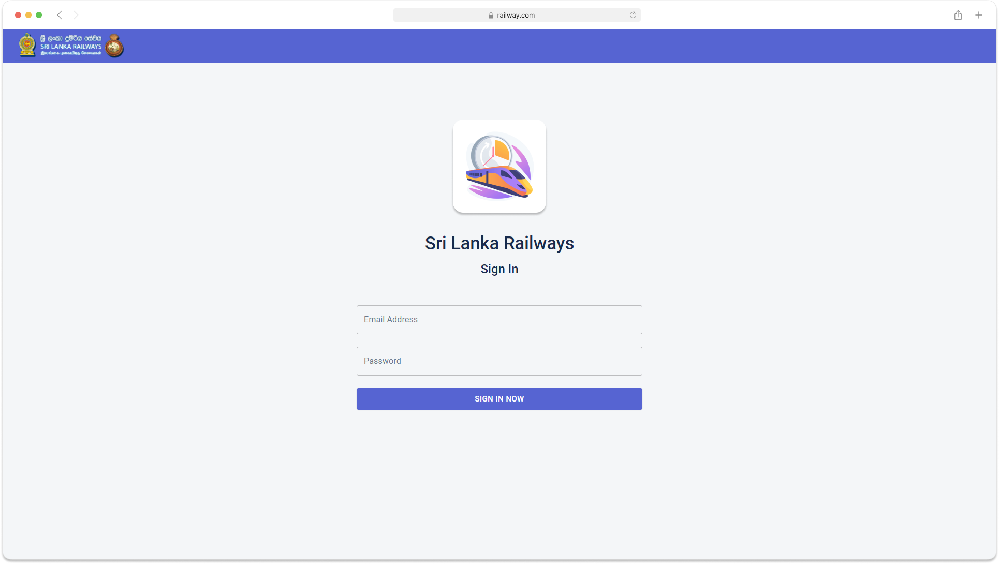
    </td>
    <td>
      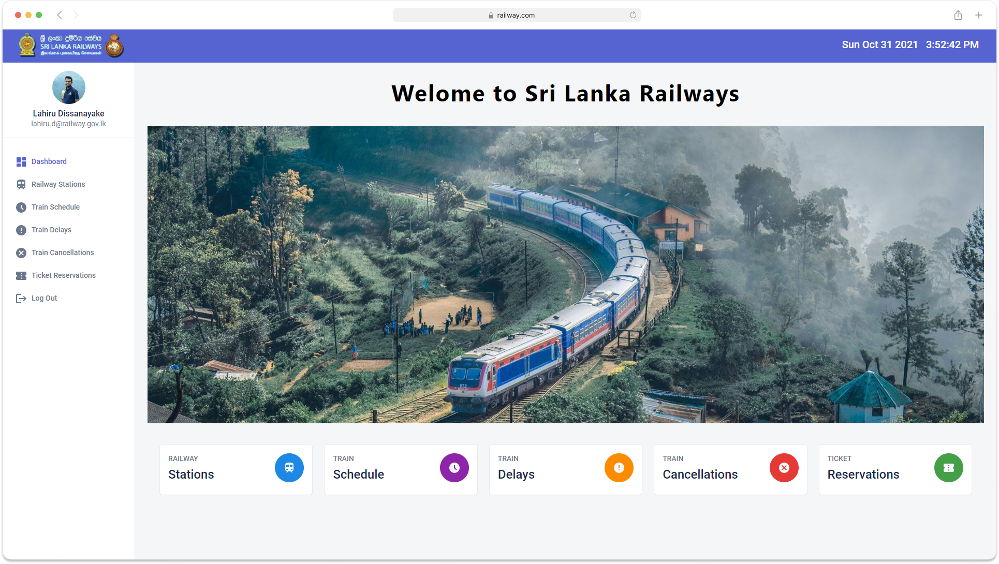
    </td>
  </tr>
  <tr>
    <td>
      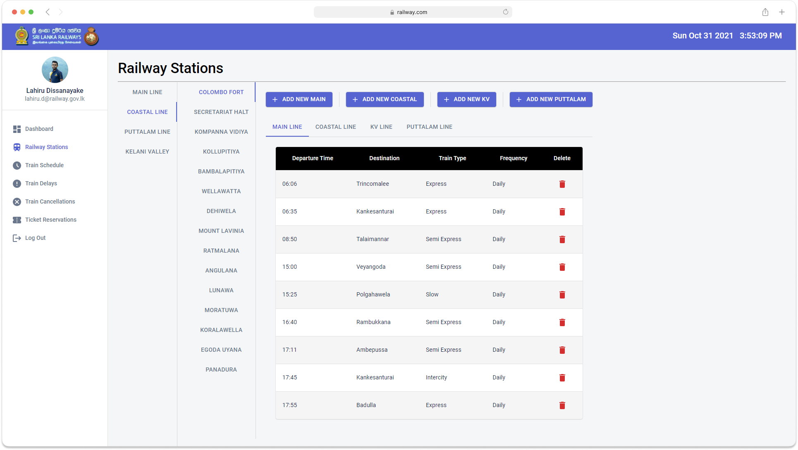
    </td>
    <td>
      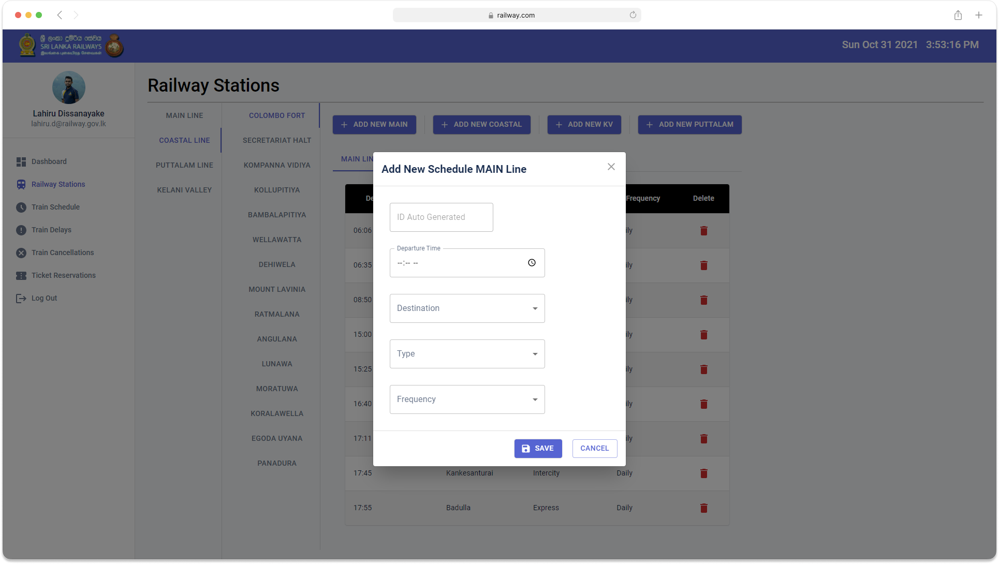
    </td>
  </tr>
  <tr>
    <td>
      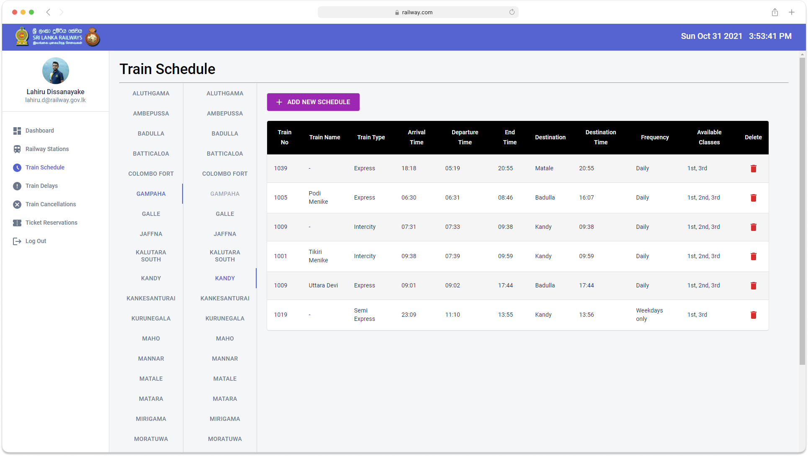
    </td>
    <td>
      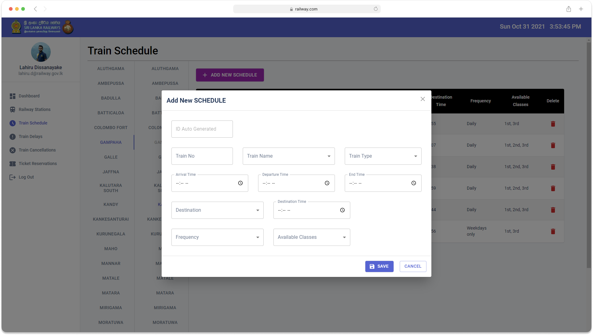
    </td>
  </tr>
  <tr>
    <td>
      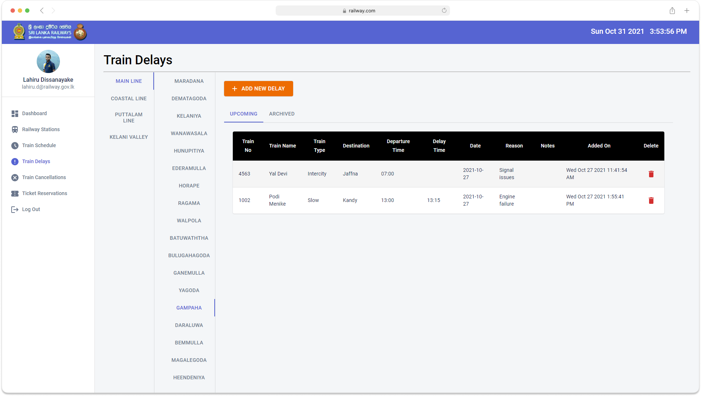
    </td>
    <td>
      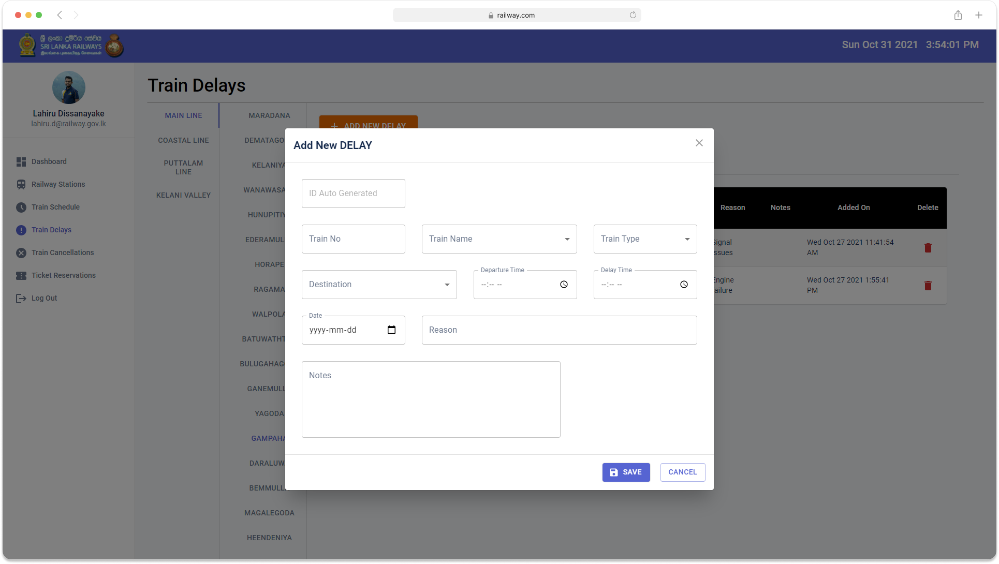
    </td>
  </tr>
  <tr>
    <td>
      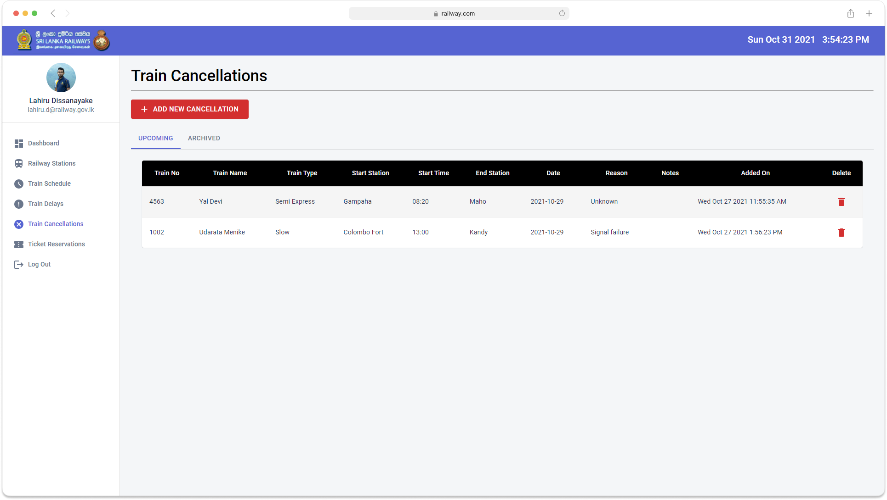
    </td>
    <td>
      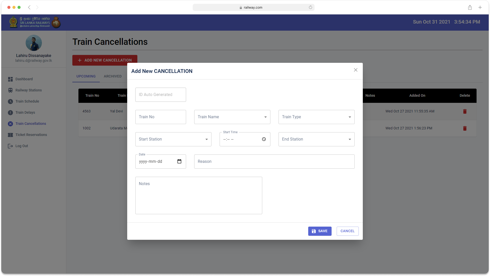
    </td>
  </tr>
  <tr>
    <td>
      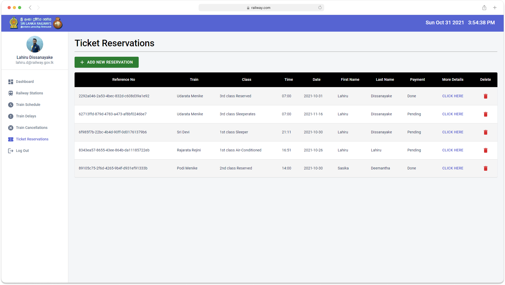
    </td>
    <td>
      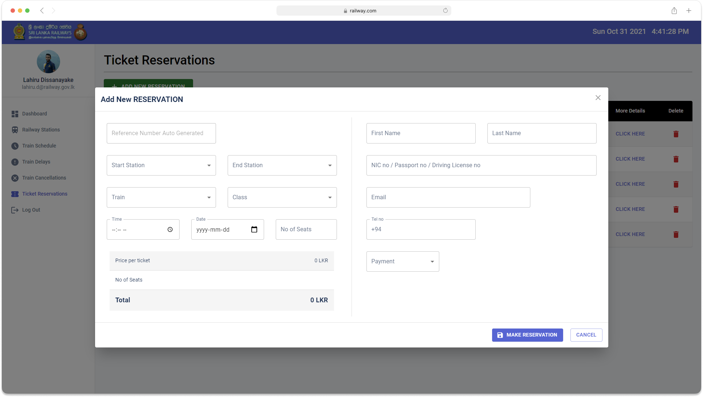
    </td>
  </tr>
</table>

## Contributing

Contributions are welcome! If you encounter any issues with the app or have new feature suggestions, please open an issue or submit a pull request.
