# Railway Management System

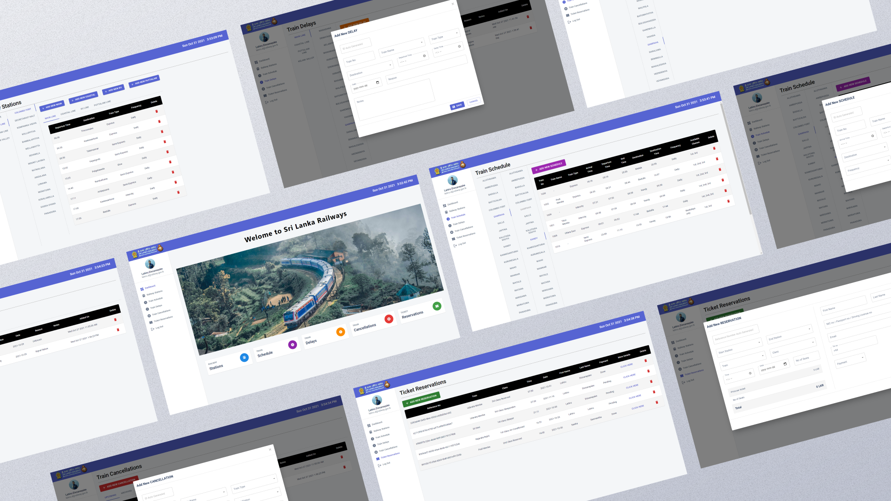

Welcome to the Railway Management System! This web-based application is designed to streamline railway operations and provide a convenient platform for managing train schedules, delays, cancellations, and ticket reservations. Built using React, Material UI and Firebase, the Railway Management System offers a comprehensive solution for railway administrators.

## Features

- **Login:** Administrators can securely log in to the system using their credentials.
- **Dashboard:** A user-friendly dashboard provides an overview of key information, such as train schedules, delays, and reservations.
- **Train Schedule by Station:** Users can view train schedules for a specific station, including departure and arrival times for different trains.
- **Train Schedule by Destination:** Users can search for train schedules based on their desired destination, making it easy to plan their journeys.
- **Train Delays:** The system provides real-time updates on train delays, allowing administrators to manage and communicate delays effectively.
- **Train Cancellations:** Users are informed about train cancellations promptly, enabling them to make alternate travel arrangements.
- **Ticket Reservation:** Passengers can reserve tickets for their desired train and route, streamlining the booking process.

## Technologies Used

- **React:** A popular JavaScript library for building user interfaces, providing a robust and efficient framework for developing dynamic web applications.
- **Material UI:** A UI component library that offers pre-built, customizable components following the Material Design guidelines, enhancing the visual appeal and user experience.
- **Cloud Firestore:** A NoSQL document database provided by Firebase, used for storing and managing data related to train schedules, delays, cancellations, and reservations.
- **Firebase Authentication:** A service provided by Firebase that allows for secure user authentication and management, ensuring that only authorized administrators can access the system.

## Getting Started

1. Clone the repository:
    ```
    git clone https://github.com/lahiru1115/Railway-Management-System.git
    ```

2. Navigate to the directory:
    ```
    cd Railway-Management-System
    ```

3. Install dependencies:
    ```
    npm install
    ```

4. Create a `.env` file in the root directory and add your Firebase configuration:
    ```
    REACT_APP_FIREBASE_KEY=
    REACT_APP_FIREBASE_DOMAIN=
    REACT_APP_FIREBASE_PROJECT_ID=
    REACT_APP_FIREBASE_STORAGE_BUCKET=
    REACT_APP_FIREBASE_SENDER_ID=
    REACT_APP_MESSAGING_APP_ID=
    REACT_APP_MEASUREMENT_ID=
    ```

5. Start the application:
    ```
    npm start
    ```

## Screenshots

<table>
  <tr>
    <td>
      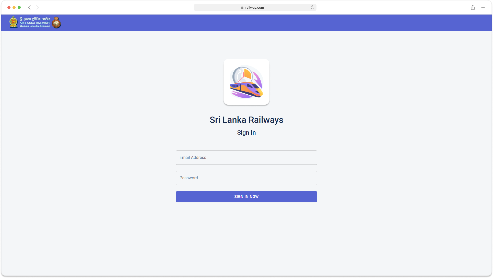
    </td>
    <td>
      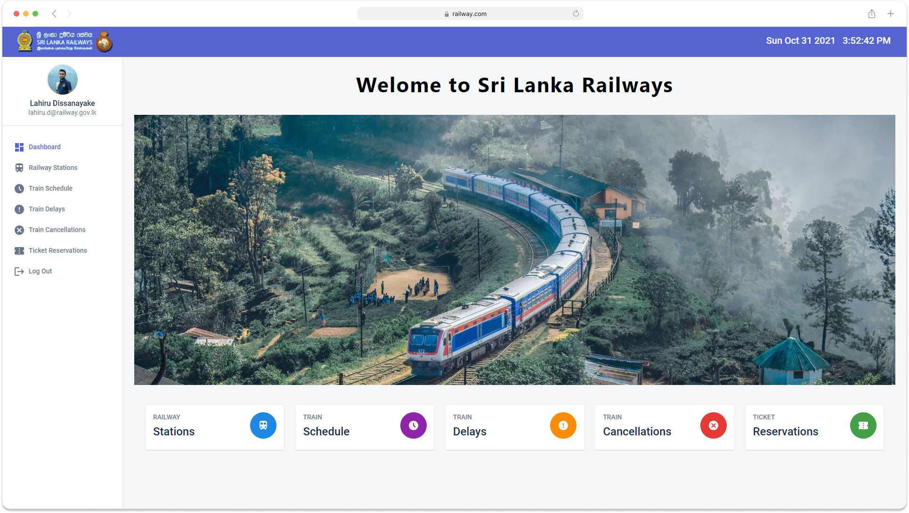
    </td>
  </tr>
  <tr>
    <td>
      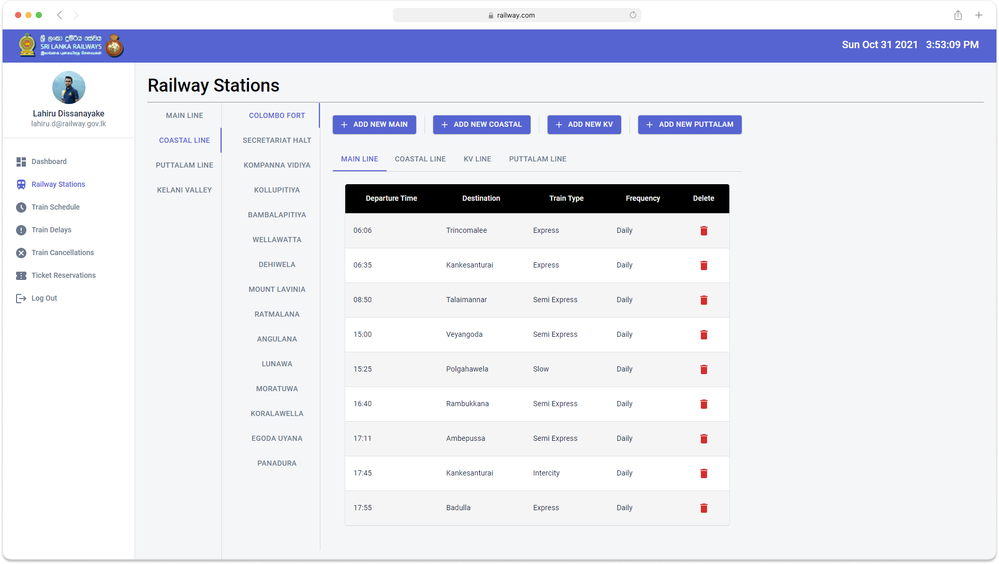
    </td>
    <td>
      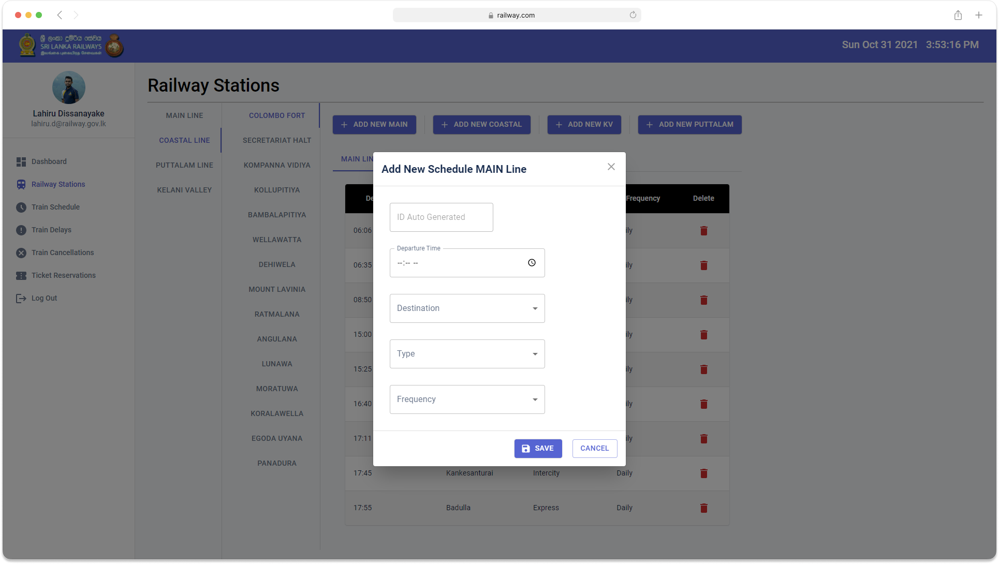
    </td>
  </tr>
  <tr>
    <td>
      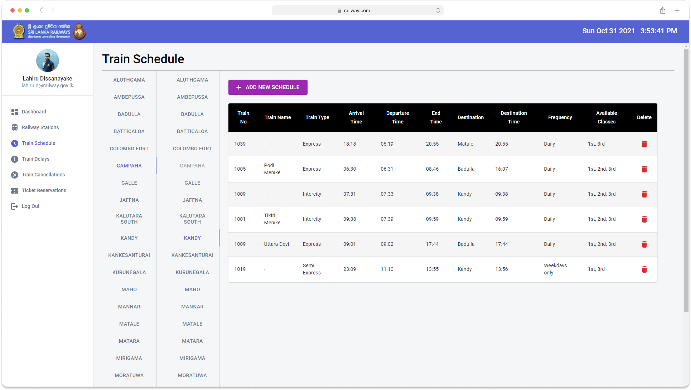
    </td>
    <td>
      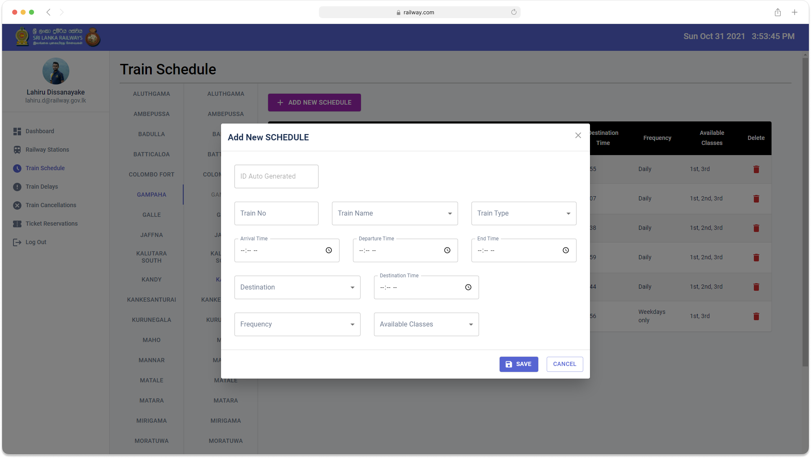
    </td>
  </tr>
  <tr>
    <td>
      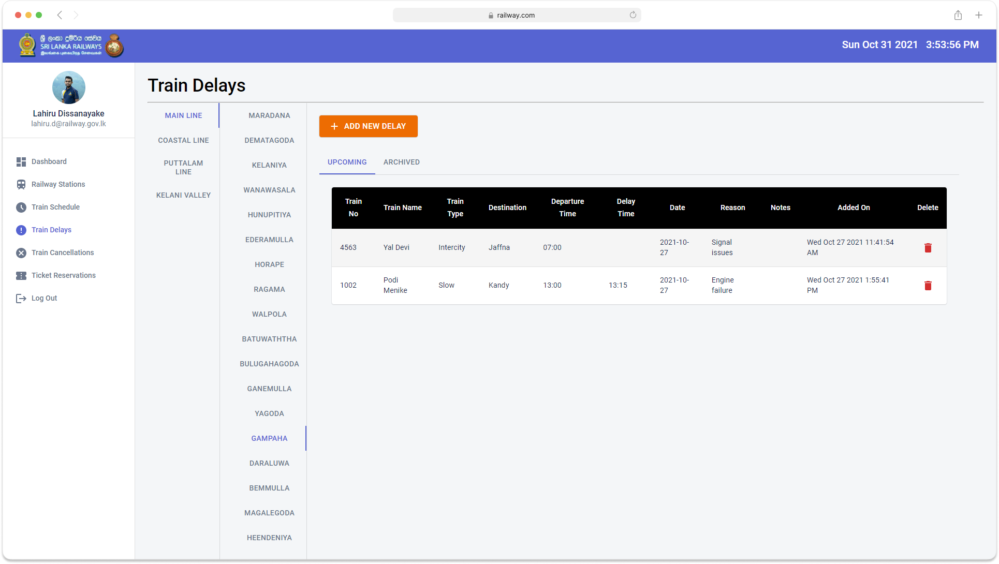
    </td>
    <td>
      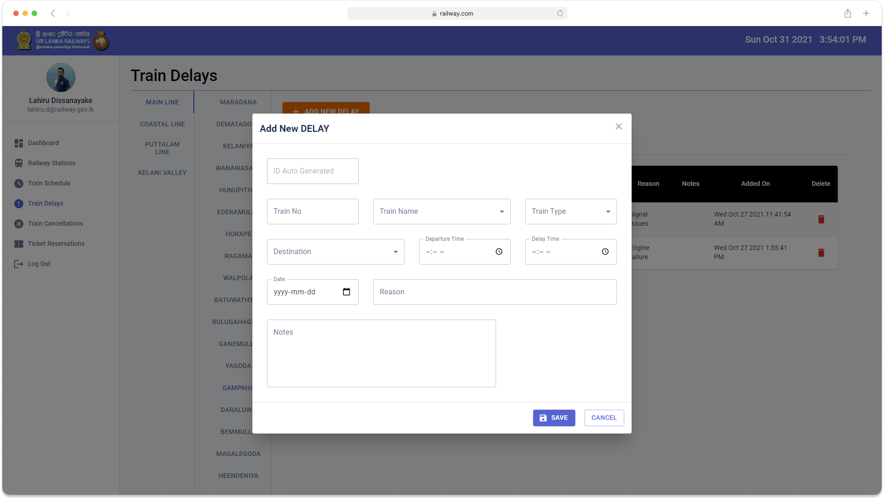
    </td>
  </tr>
  <tr>
    <td>
      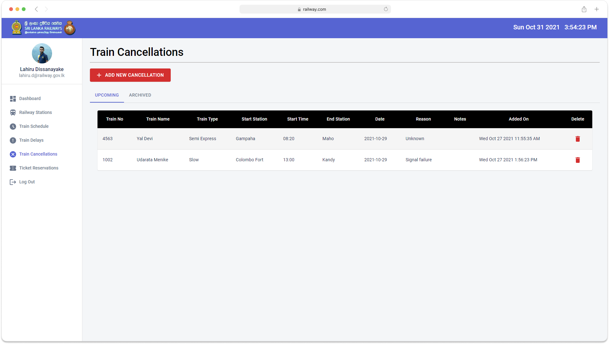
    </td>
    <td>
      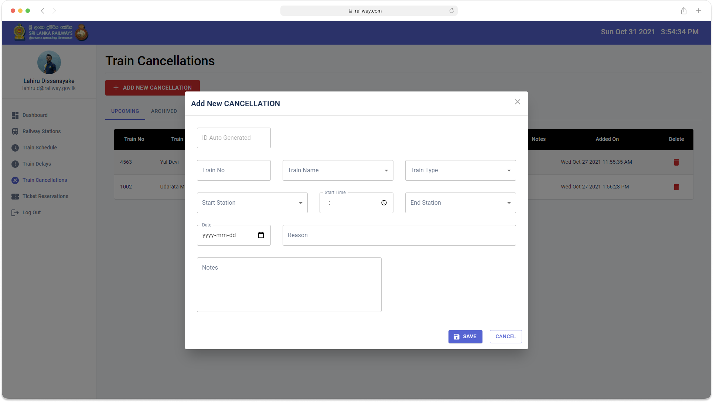
    </td>
  </tr>
  <tr>
    <td>
      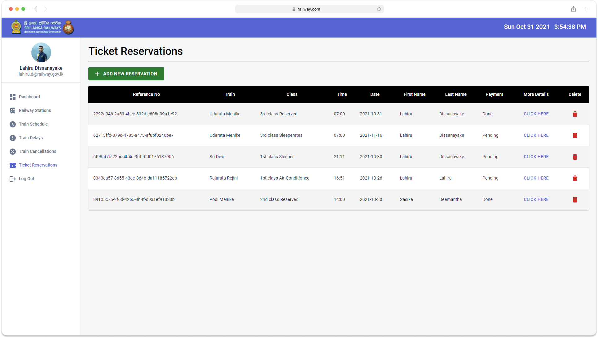
    </td>
    <td>
      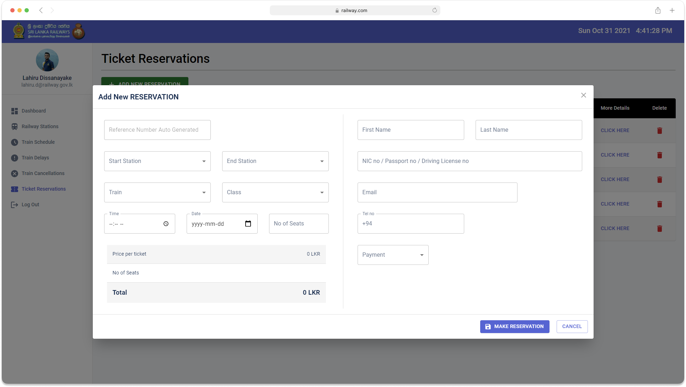
    </td>
  </tr>
</table>

## Contributing

Contributions are welcome! If you encounter any issues with the app or have new feature suggestions, please open an issue or submit a pull request.
